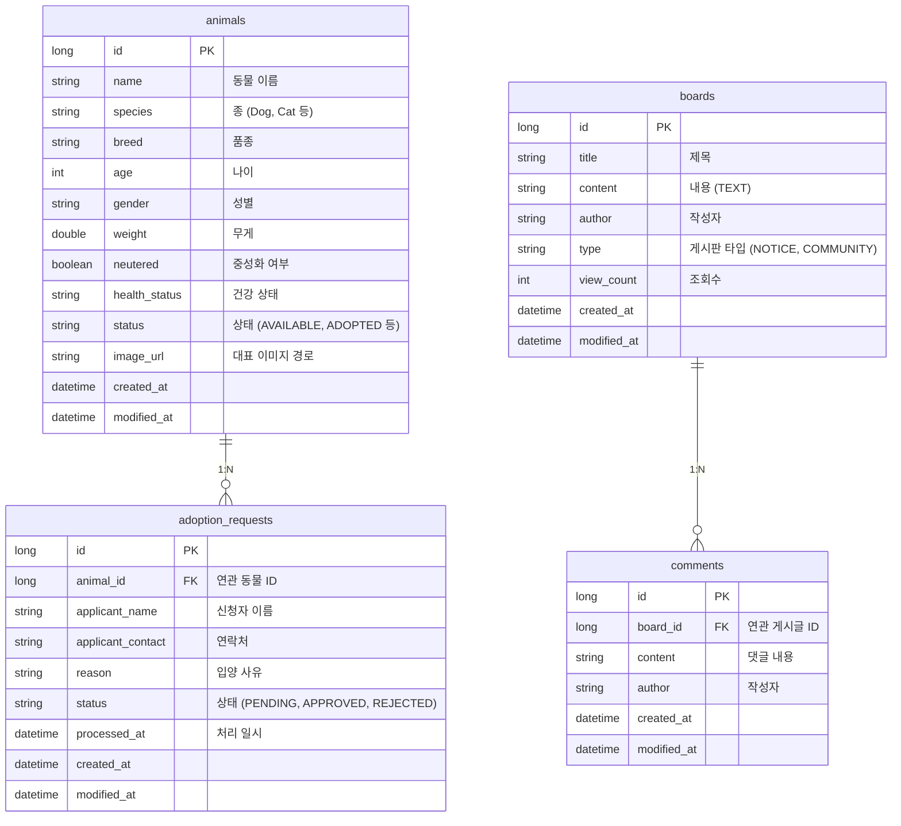

# 🗄️ DATABASE Documentation

Antigravity 동물 관리 시스템의 데이터베이스 구조와 엔티티 설계를 설명합니다.

---

## 🏗️ 데이터베이스 아키텍처

- **개발 환경 (Dev)**: H2 In-memory Database (`jdbc:h2:mem:animaldb`)
- **운영 환경 (Prod)**: MySQL (RDS 등 외부 DB)

### 아키텍처 다이어그램 (ERD)

---

## 🔍 주요 엔티티 상세 설명

### 1. `Animal` (동물 개체)
보호소에서 관리하는 동물의 핵심 정보를 담고 있습니다.
- `status`: `AVAILABLE`(입양 가능), `PENDING_ADOPTION`(진행 중), `ADOPTED`(완료), `INACTIVE`(비활성)

### 2. `AdoptionRequest` (입양 신청)
입양 신청자와 대상 동물 간의 연결 정보를 관리합니다.
- `status`: `PENDING`(대기), `APPROVED`(승인), `REJECTED`(반려), `CANCELED`(취소)

### 3. `Board` & `Comment` (게시판 및 댓글)
공지사항과 커뮤니티 기능을 담당합니다.
- `type`: `NOTICE`(공지사항), `COMMUNITY`(자유게시판)

---

## 🔄 마이그레이션 관리

스키마 변경 사항은 `backend/docs/migrations` 폴더에서 SQL 파일로 관리됩니다.
- 운영 환경 적용 시 `spring.jpa.hibernate.ddl-auto: none` 설정을 유지하며 수동 마이그레이션을 권장합니다.
